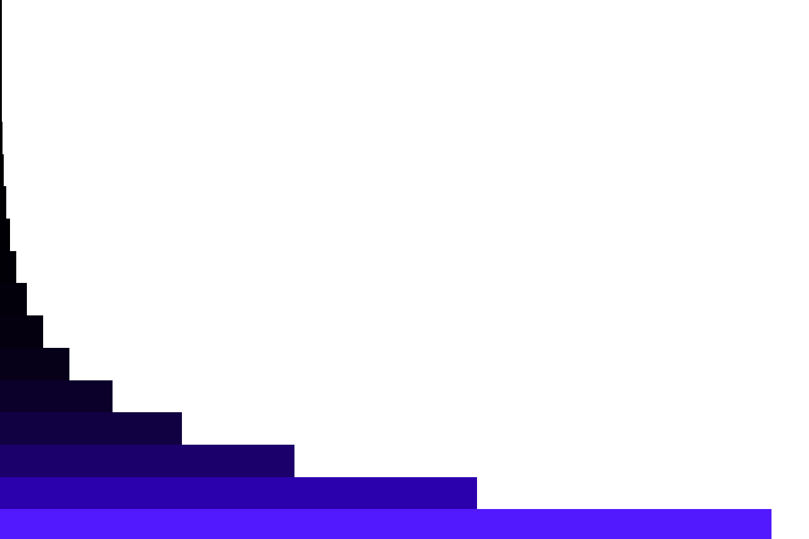

# JS Fibonacci Sequence ➕

Code that generates and visualizes the fibonacci sequence, which goes by the formula:

$$ Fn = Fn-1 + Fn-2 $$

What this means is for a given number in the sequence, you get that number by adding the 2 numbers before it.

snippet of the sequence: `1, 1, 2, 3, 5`

2 is gotten from 1 + 1,

3 is gotten from 1 + 2,

5 is gotten from 2 + 3,

## Features ✨

- Visualization of the fibonacci sequence, using a vertical bar graph, where the length and color of the bars represents a number in the sequence.

- Ability to generate a single number from the sequence, or the sequence itself(given a range)

## Installation & Usage 🛠️

### Cloning and Navigating to repo

1. Clone the repository using `git clone https://github.com/BeanyTheCoder/js-fibonacci-sequence.git`.

2. Navigate to the project directory using `cd  js-fibonacci-sequence`.

### Usage on web

- Open the `index.html` file using any web browser of your choice.

### Usage in editor

- Open `script.js` or `script.mjs` using any text editor of your choice.

- Run using either
  _Quokka.js_ or _Node.js_ (instructions for both in project file)

## Screenshots 📷

_image of visualized fibonacci sequence ^_

## Technologies Used 🛠️

- JavaScript
- HTML & CSS

## License 📝

This project is licensed under the [License Name](link-to-license-file).

## Contact 📧

For any questions or feedback, feel free to reach out to me at alexanderafoko@gmail.com.
